# Simple Docker
Введение в докер. Разработка простого докер образа для собственного сервера.  

## Part 1. Готовый докер
В качестве конечной цели небольшой практики, нужно написать докер образ для собственного веб сервера, а потому в начале нужно разобраться с уже готовым докер образом для сервера.
Выбор пал на довольно простой nginx.  
> * Docker - это открытая платформа для разработки, доставки и запуска приложений в контейнерах.  
> * Nginx - это веб-сервер и обратный прокси-сервер с открытым исходным кодом. Он обладает выдающейся производительностью и используется для обслуживания веб-сайтов и приложений.  

1.1 Взять официальный докер образ с nginx и выкачать его при помощи **docker pull**  
1.2 Проверить наличие докер образа через **docker images**  
1.3 Запустить докер образ через **docker run -d [image_id|repository]**  
1.4 Проверить, что образ запустился через **docker ps**  
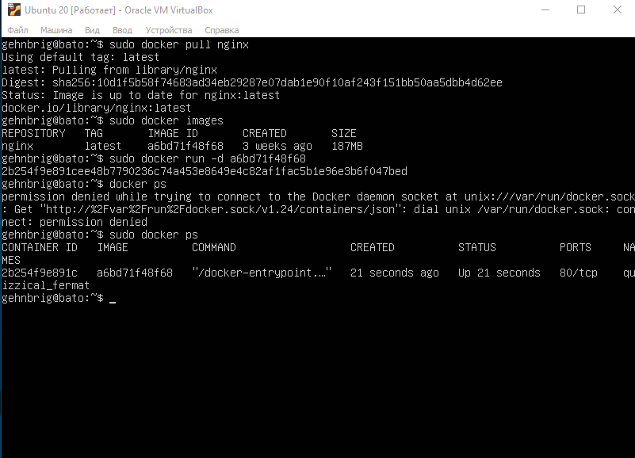  
1.5 Посмотреть информацию о контейнере через **docker inspect [container_id|container_name]**  
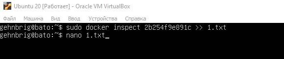  
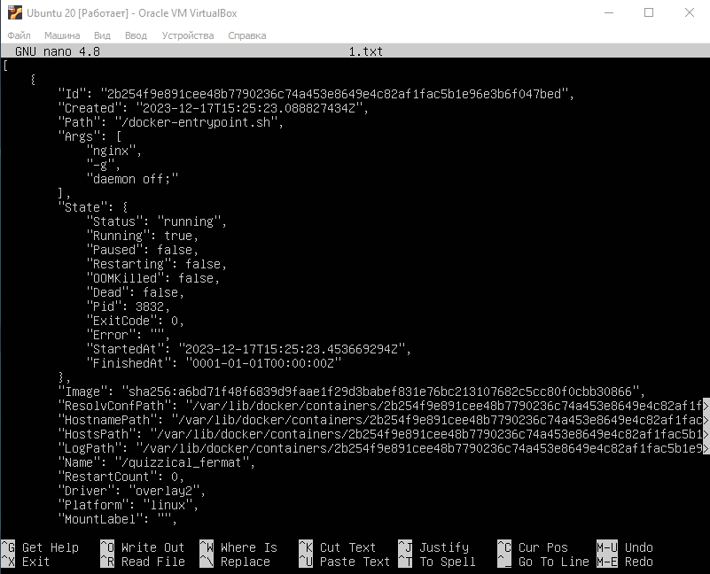  
1.6 По выводу команды определить и поместить в отчёт размер контейнера, список замапленных портов и ip контейнера  
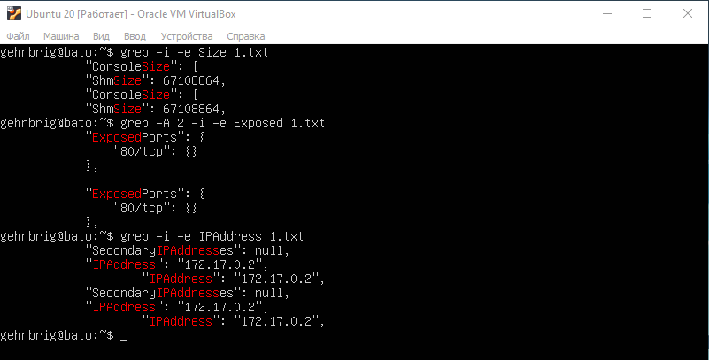  
1.7 Остановить докер образ через **docker stop [container_id|container_name]**  
1.8 Проверить, что образ остановился через **docker ps**  
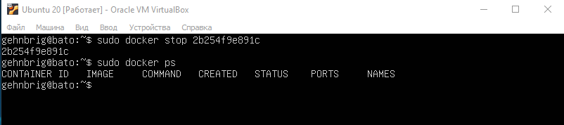  
1.9 Запустить докер с портами **80** и **443** в контейнере, замапленными на такие же порты на локальной машине, через команду **run**  
1.10 Проверить, что в браузере по адресу **localhost:80** доступна стартовая страница nginx  
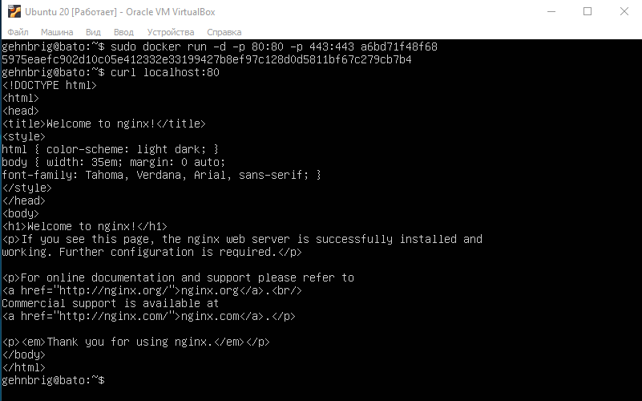  
1.11 Перезапустить докер контейнер через **docker restart [container_id|container_name]**  
1.12 Проверить любым способом, что контейнер запустился  
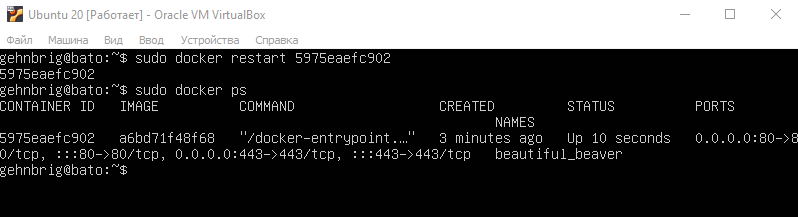  
## Part 2. Операции с контейнером
Докер образ и контейнер готовы. Теперь можно покопаться в конфигурации nginx и отобразить статус страницы.  

2.1 Прочитать конфигурационный файл nginx.conf внутри докер контейнера через команду **exec**  
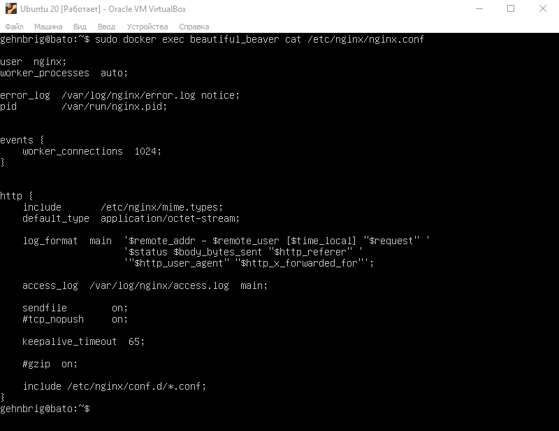  
2.2 Создать на локальной машине файл **nginx.conf**  
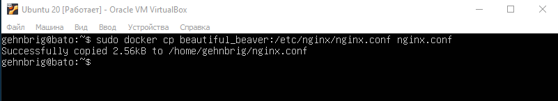  
2.3 Настроить в нем по пути **/status** отдачу страницы статуса сервера **nginx**  
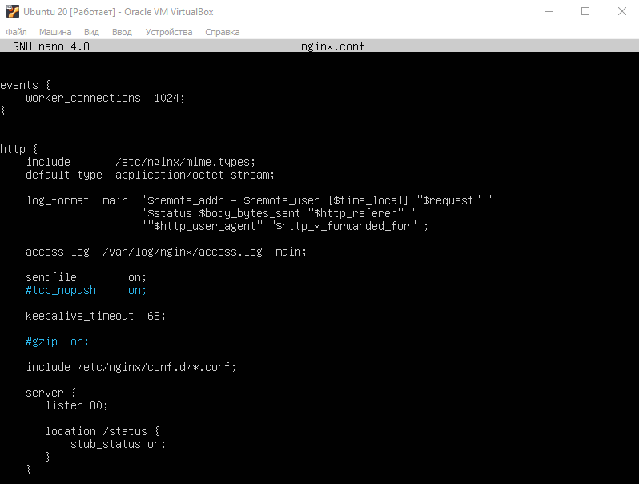  

> **server** : Объявление блока настроек для сервера.  
> **listen 80**: Указывает серверу слушать запросы на порту 80. Порт 80 используется для HTTP-трафика.  
> **location /status**: Определение блока настроек для определенного URI. В данном случае, настройки будут применяться к URI "/status"  
> **stub_status on**: Включает модуль stub_status, который предоставляет простую статистику о работе сервера. Этот URI "/status" будет отображать информацию о текущей активности сервера, такую как количество активных соединений, количество запросов в секунду и другие статистические данные  
> 
2.4 Скопировать созданный файл **nginx.conf** внутрь докер образа через команду **docker cp**  
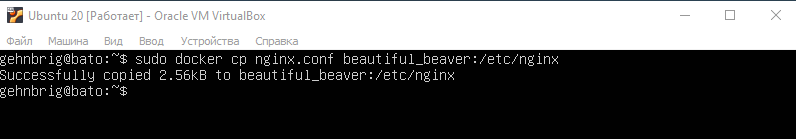  
2.5 Перезапустить nginx внутри докер образа через команду **exec**  
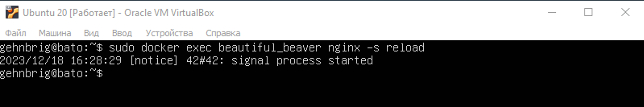  
2.6 Проверить, что по адресу **localhost:80/status** отдается страничка со статусом сервера nginx
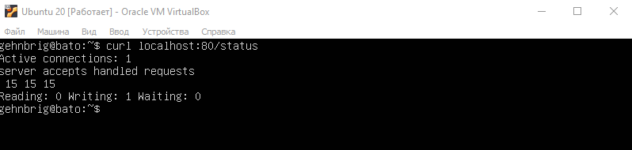  
2.7 Экспортировать контейнер в файл **container.tar** через команду **export**  
2.8 Остановить контейнер  
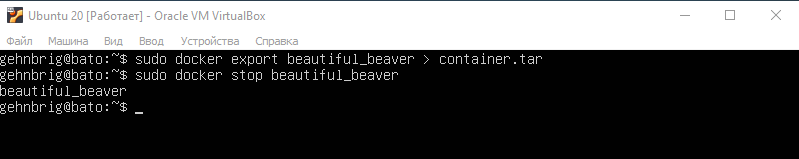  
2.9 Удалить образ через **docker rmi [image_id|repository]**, не удаляя перед этим контейнеры  
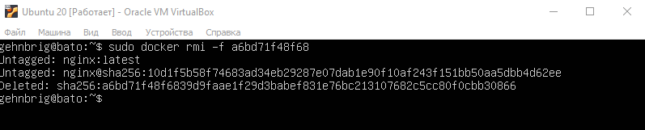  
2.10 Удалить остановленный контейнер  
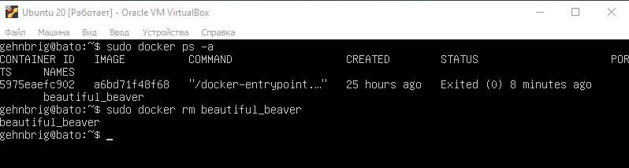  
2.11 Импортировать контейнер обратно через команду **import**  
> **["nginx", "-g", "daemon off;"]** гарантирует, что Nginx останется «на переднем плане», так что Docker сможет правильно отслеживать процесс (в противном случае контейнер остановится сразу после запуска)  
> 
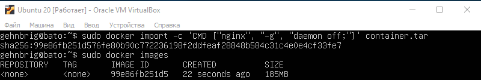  
2.12 Запустить импортированный контейнер  
2.13 Проверить, что по адресу **localhost:80/status** отдается страничка со статусом сервера **nginx**  
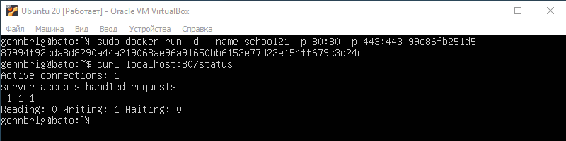  
## Part 3. Мини веб-сервер
Настало время написать свой сервер.  

3.1 Написать мини сервер на C и FastCgi, который будет возвращать простейшую страничку с надписью Hello World!  
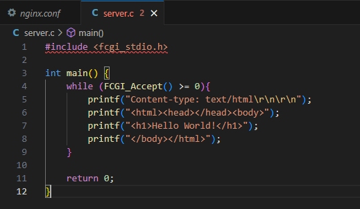  
3.2 Написать свой nginx.conf, который будет проксировать все запросы с 81 порта на 127.0.0.1:8080  
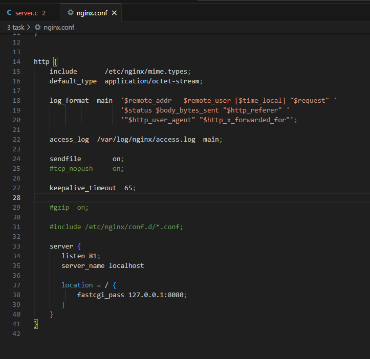  
3.3 Запустить контейнер на 81 порту  
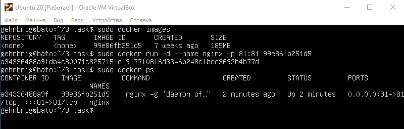  
3.4 Скопировать файлы nginx.conf и server.c в контейнер  
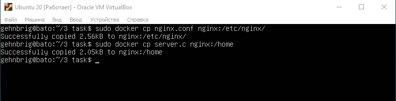  
3.5 С помощью терминала внутри контейнера, установить нужные программы  
`apt-get install lighttpd` это легкий веб-сервер, который может быть использован вместе с FastCGI для обработки динамических запросов  
`apt-get install libfcgi-dev` эта команда устанавливает заголовочные файлы и библиотеки разработки для FastCGI  
`apt-get install gcc` компилятор gcc   
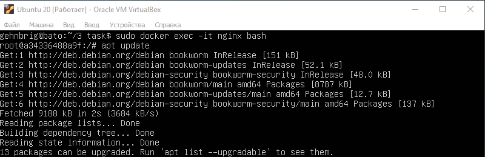  
3.6 Запустить написанный мини сервер через spawn-fcgi на порту 8080    
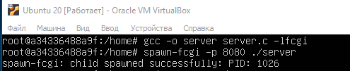  
3.7 Перезагрузить сервер nginx  
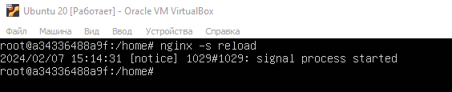  
3.8 Проверить, что в браузере по localhost:81 отдается написанная вами страничка  
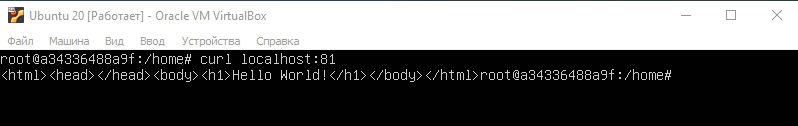  
## Part 4. Свой докер
Можно приступать к написанию докер образа для созданного сервера.  

4.1 Написать свой докер образ, который:
1) собирает исходники мини сервера на FastCgi из Части 3
2) запускает его на 8080 порту
3) копирует внутрь образа написанный ./nginx/nginx.conf
4) запускает nginx.  

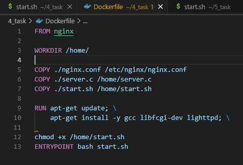  
Пишем start.sh, в котором записываем команды для ENTRYPOINT  
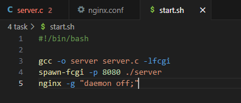  
> Команда **nginx -g "daemon off;"** используется для запуска сервера Nginx в переднем плане (foreground mode), отключая при этом режим демона (daemon mode)`  

4.2 Собрать написанный докер образ через docker build при этом указав имя и тег  
`sudo docker build -t bato:latest .`  
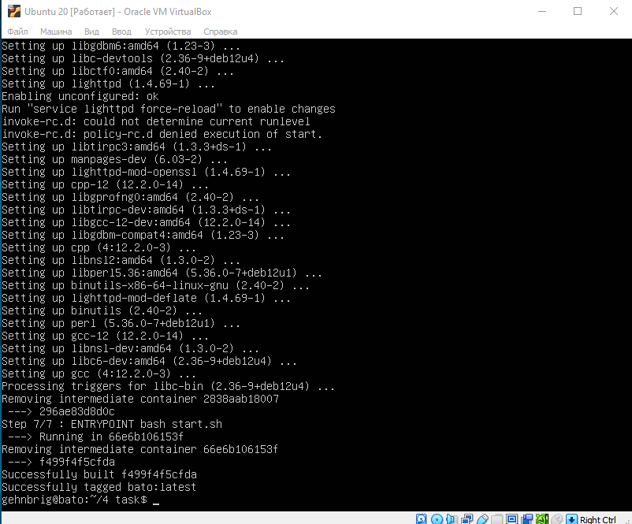  
4.3 Проверить через docker images, что все собралось корректно  
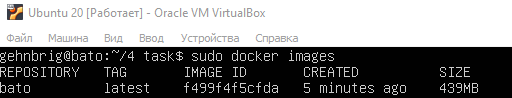  
4.4 Запустить собранный докер образ с маппингом 81 порта на 80 на локальной машине и маппингом папки ./nginx внутрь контейнера по адресу, где лежат конфигурационные файлы nginx'а   
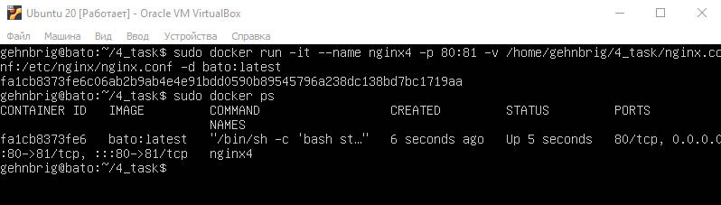  
4.5 Проверить, что по localhost:80 доступна страничка написанного мини сервера  
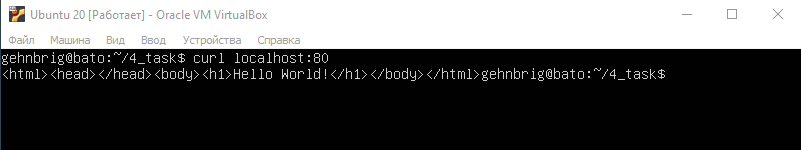  
4.6 Дописать в ./nginx/nginx.conf проксирование странички /status, по которой надо отдавать статус сервера nginx  
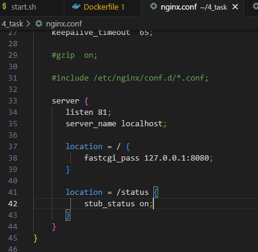  
4.7 Перезапустить nginx в своем docker-образе командой nginx -s reload 
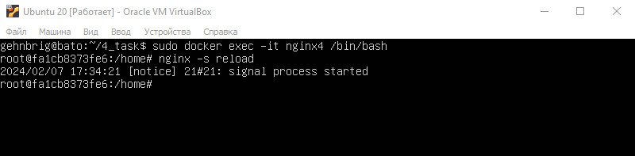  
4.8 Проверить, что теперь по localhost:80/status отдается страничка со статусом nginx  
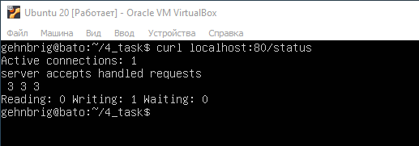  
## Part 5. Dockle
>Dockle — инструмент для проверки безопасности образов контейнеров, который можно использовать для поиска уязвимостей. Кроме того, с его помощью можно выполнять проверку на соответствие Best Practice, чтобы убедиться, что образ действительно создаётся на основе сохраненной истории команд. 
>Интсрукция по установке Dockle https://github.com/goodwithtech/dockle?tab=readme-ov-file#debianubuntu

После написания образа никогда не будет лишним проверить его на безопасность  

5.1 Просканировать образ из предыдущего задания через dockle [image_id|repository]  
`sudo dockle bato:latest`  
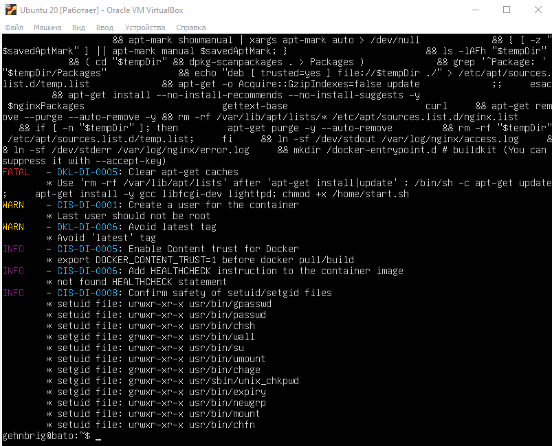  
5.2 Исправить образ так, чтобы при проверке через dockle не было ошибок и предупреждений  
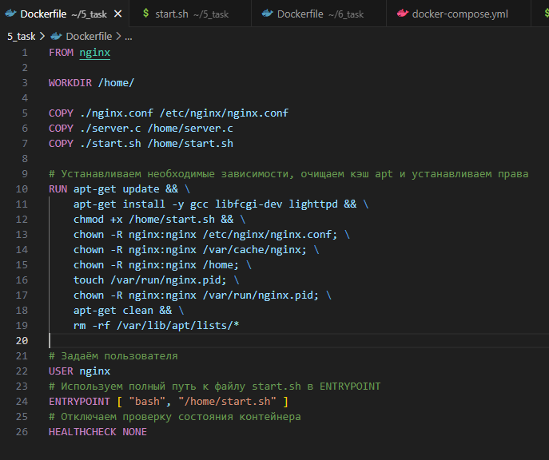  
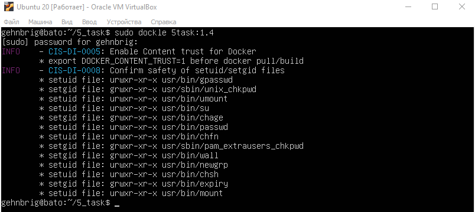  
## Part 6. Базовый Docker Compose
Почему бы не поэкспериментировать с развёртыванием проекта, состоящего сразу из нескольких докер образов?  

> Docker Compose — это инструмент для определения и запуска многоконтейнерных Docker-приложений. С его помощью вы можете описать все сервисы, сети, тома и другие аспекты вашего приложения в файле docker-compose.yml, после чего одной командой запустить все контейнеры, необходимые для вашего приложения.  
> Установка Docker Compose `https://www.digitalocean.com/community/tutorials/how-to-install-and-use-docker-compose-on-ubuntu-20-04`  

6.1 Написать файл docker-compose.yml, с помощью которого:
1) Поднять докер контейнер из Части 5 (он должен работать в локальной сети, т.е. не нужно использовать инструкцию EXPOSE и мапить порты на локальную машину)
2) Поднять докер контейнер с nginx, который будет проксировать все запросы с 8080 порта на 81 порт первого контейнера  
3) Замапить 8080 порт второго контейнера на 80 порт локальной машины  
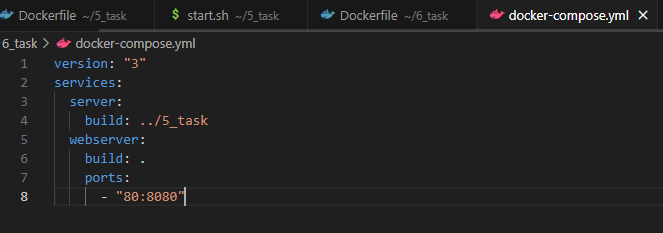  
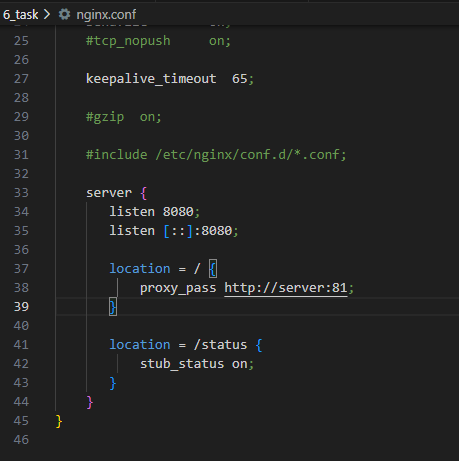  

6.2 Остановить все запущенные контейнеры  
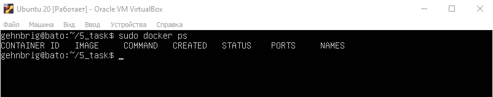  
6.3 Собрать проект с помощью команд docker-compose build  
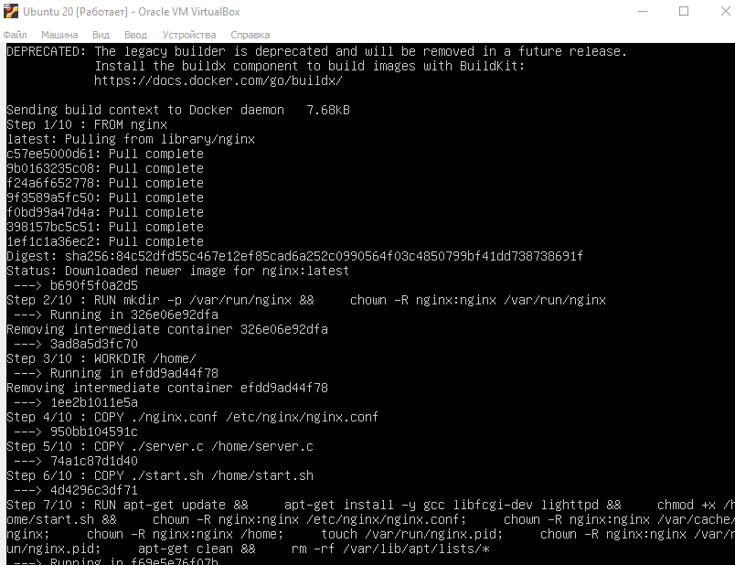  
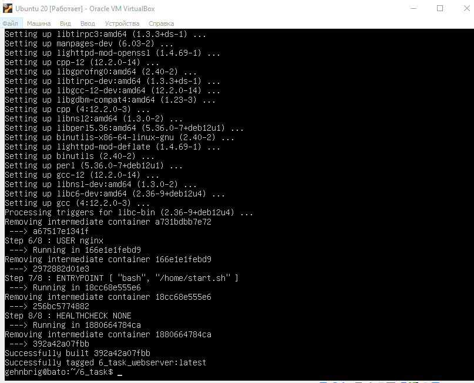  
6.4 Запустить с помощью docker-compose up  
6.5 Проверить, что в браузере по localhost:80 отдается написанная вами страничка, как и ранее  
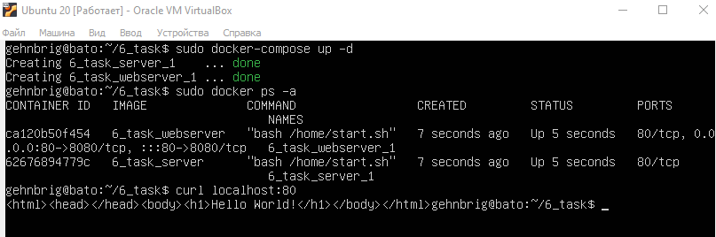  
> В этом проекте, Docker используется для упаковки и запуска приложения, состоящего из веб-сервера Nginx и FastCGI сервера.
> Nginx обрабатывает HTTP-запросы, а также передаёт их FastCGI серверу, который обрабатывает динамические запросы.  
